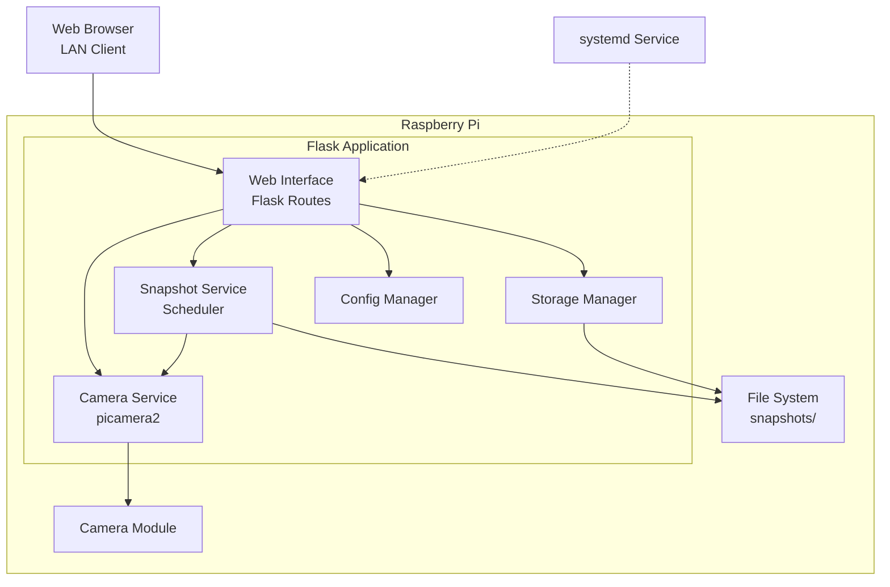

# Design Document - mimamori-pi

## Overview

mimamori-piは、Raspberry Pi上で動作するPython/Flaskベースの赤ちゃん見守りシステムです。picamera2ライブラリを使用してカメラを制御し、Motion JPEG形式でリアルタイムストリーミングを提供します。システムは単一のFlaskアプリケーションとして実装され、Webインターフェース、カメラ制御、スナップショット管理を統合します。

### 技術スタック

- **言語**: Python 3.12+
- **パッケージマネージャ**: uv
- **Webフレームワーク**: Flask 3.0+
- **カメラライブラリ**: picamera2
- **フロントエンド**: HTML5, CSS3, JavaScript (Vanilla)
- **プロセス管理**: systemd
- **ストレージ**: ローカルファイルシステム
- **コード品質**: Ruff (フォーマット・リント)
- **型チェック**: mypy
- **テスト**: pytest + pytest-asyncio + coverage (80%以上)

### 設計原則

1. **シンプルさ**: 単一プロセスで動作し、外部依存を最小限に
2. **信頼性**: カメラエラーやネットワーク障害に対する適切なエラーハンドリング
3. **拡張性**: 将来の機械学習機能追加を考慮したモジュール設計
4. **パフォーマンス**: 低遅延ストリーミングとリソース効率

## Architecture

### システムアーキテクチャ図



### コンポーネント構成（Phase 1: 単一パッケージ）

```
mimamori-pi/
├── src/
│   └── mimamori_pi/
│       ├── __init__.py
│       ├── app.py                 # Flaskアプリケーションエントリーポイント
│       ├── config/                 # 設定管理パッケージ
│       │   ├── __init__.py
│       │   ├── settings.py         # アプリケーション設定（Settingsクラス）
│       │   └── logging_config.py  # ロギング設定
│       ├── camera/
│       │   ├── __init__.py
│       │   └── camera_service.py  # カメラ制御ロジック
│       ├── storage/
│       │   ├── __init__.py
│       │   └── local_storage.py   # ローカルストレージ管理
│       ├── snapshot/
│       │   ├── __init__.py
│       │   └── snapshot_service.py # スナップショット管理
│       ├── routes/
│       │   ├── __init__.py
│       │   ├── main.py            # メインページルート
│       │   ├── stream.py          # ストリーミングルート
│       │   ├── api.py             # REST APIエンドポイント
│       │   └── snapshots.py       # スナップショット閲覧ルート
│       ├── templates/
│       │   ├── base.html          # ベーステンプレート
│       │   ├── index.html         # メインページ
│       │   └── snapshots.html     # スナップショット一覧
│       └── static/
│           ├── css/
│           │   └── style.css
│           └── js/
│               └── app.js         # フロントエンドロジック
├── tests/
│   ├── __init__.py
│   ├── test_app.py                  # Flaskアプリ初期化テスト
│   ├── test_camera_service.py      # カメラサービステスト
│   ├── test_logging_config.py      # ロギング設定テスト
│   ├── test_routes_main.py         # メインルートテスト
│   ├── test_routes_stream.py       # ストリーミングルートテスト
│   └── test_settings.py            # 設定クラステスト
├── scripts/
│   ├── setup.sh                   # 初期セットアップスクリプト
│   └── install_service.sh         # systemdサービスインストール
├── data/                          # データディレクトリ（.gitignore）
│   ├── snapshots/                 # ローカル画像保存
│   │   └── YYYY-MM-DD/
│   └── logs/                      # ログファイル
├── mimamori-pi.service            # systemdサービス定義
├── pyproject.toml                 # プロジェクト設定（uv使用）
├── README.md
├── .gitignore
└── .env.example                   # 環境変数テンプレート
```

### 将来のモノレポ移行計画

Phase 2以降でクラウド統合や機械学習機能が必要になった時点で、以下の構成に移行します：

```
mimamori-pi/
├── core/                          # Phase 1のコードをリファクタリング
│   └── src/mimamori_pi/
├── cloud/                         # Phase 2: クラウド統合
│   ├── lambda/
│   └── terraform/
└── ml/                            # Phase 3: 機械学習
    └── src/mimamori_ml/
```

この段階的アプローチにより、YAGNI原則に従いながら、将来の拡張性も確保します。

## Components and Interfaces

### 1. Camera Service

**責務**: picamera2を使用したカメラ制御、ストリーミング、設定管理

**実装済み機能** (Phase 1 - タスク3.1-4.2):
- カメラの起動・停止 (`start()`, `stop()`)
- Settingsからの解像度・フレームレート設定の適用
- picamera2未利用時のエラーハンドリング（ImportError）
- カメラ初期化失敗時のエラーハンドリング（RuntimeError）
- 重複起動の防止
- Motion JPEGストリーミングの生成 (`generate_stream()`)
- ロギング（初期化、起動、停止、ストリーミング、エラー）

**未実装機能** (将来のタスク):
- カメラ回転設定（0/90/180/270度）
- 静止画キャプチャ
- カメラ状態の取得

**実装詳細**:
- `src/mimamori_pi/camera/camera_service.py`: CameraServiceクラス（カバレッジ100%）
- `tests/test_camera_service.py`: ユニットテスト（12テストケース、カバレッジ100%）

**使用例**:
```python
from mimamori_pi.camera import CameraService
from mimamori_pi.config import Settings, setup_logging

# ロギング設定を初期化
setup_logging()

# アプリケーション設定を読み込み
settings = Settings()

# CameraServiceインスタンスを作成
camera_service = CameraService(settings)

# カメラを起動
try:
    camera_service.start()
    # カメラが起動中...
except RuntimeError as e:
    print(f"カメラの起動に失敗しました: {e}")

# Motion JPEGストリームを生成
try:
    for frame in camera_service.generate_stream():
        # フレームを処理（例: Flaskレスポンスとして送信）
        # frameは multipart/x-mixed-replace 形式のJPEGフレーム
        pass
except RuntimeError as e:
    print(f"ストリーム生成に失敗しました: {e}")

# カメラを停止
camera_service.stop()
```

**エラーハンドリング**: カメラ初期化失敗、ストリーミングエラー、切断時の適切なクリーンアップ

### 2. Snapshot Service

**責務**: 定期的な静止画保存とスケジューリング

**主要機能**:
- 設定可能な間隔での自動スナップショット（5/10/30/60分）
- 手動スナップショット取得
- バックグラウンドスケジューラ管理

**実装方針**: Pythonの`threading`を使用した定期実行、カメラ稼働中のみ取得

### 3. Storage Service

**責務**: ファイルシステム操作とストレージ管理

**主要機能**:
- スナップショットの保存（日付ごとにディレクトリ整理）
- スナップショット一覧取得・削除
- ストレージ使用状況監視
- 自動クリーンアップ（90%超過時）

**ファイル命名規則**: `YYYY-MM-DD/YYYYMMDD_HHMMSS.jpg`

### 4. Config Manager

**責務**: アプリケーション設定の一元管理

**実装**: `mimamori_pi.config.Settings` クラス

**設定項目**:
- Flask設定（ホスト、ポート、シークレットキー、デバッグモード）
- カメラ設定（解像度、フレームレート）
- ログ設定（ログレベル、コンソール/ファイル出力、ログローテーション）
- スナップショット設定（間隔、保存先）※将来実装
- ストレージ設定（クリーンアップ閾値）※将来実装

**環境変数からの読み込み**:
- `.env` ファイルまたは環境変数から設定を読み込む（`python-dotenv`使用）
- 環境変数が未設定の場合はデフォルト値を使用
- 型変換と検証機能を実装（整数、真偽値、解像度のパース）

**ログ設定**:
- `mimamori_pi.config.logging_config.setup_logging()` 関数でロギングを初期化
- 環境変数 `MIMAMORI_PI_LOG_LEVEL` でログレベルを制御（デフォルト: `INFO`）
- コンソール（`StreamHandler`）とファイル（`RotatingFileHandler`）の両方に出力
- ログファイル: `data/logs/mimamori-pi.log`（自動的にディレクトリ作成）
- ログローテーション: 10MBごと、最大5ファイルまで保持

**使用例**:
```python
from mimamori_pi.config import Settings, setup_logging

# ロギング設定を初期化
setup_logging()

# アプリケーション設定を読み込み
settings = Settings()
flask_config = settings.to_flask_config()
resolution = settings.CAMERA_RESOLUTION  # (640, 480)
```

### 5. Web Routes

**実装済み機能** (Phase 1 - タスク5.1-5.2):
- Flaskアプリケーションの初期化 (`app.py`)
- ストリーミングルート (`routes/stream.py`)
  - `/video_feed`: Motion JPEGストリーム提供（multipart/x-mixed-replace形式）
  - `/stream/start` (POST): ストリーミング開始
  - `/stream/stop` (POST): ストリーミング停止
- エラーハンドリング（カメラ未起動時、picamera2未利用時）

**実装詳細**:
- `src/mimamori_pi/app.py`: Flaskアプリケーションエントリーポイント（カバレッジ100%）
- `src/mimamori_pi/routes/stream.py`: ストリーミングルート（カバレッジ100%）
- `tests/test_app.py`: アプリ初期化テスト（8テストケース）
- `tests/test_routes_stream.py`: ストリーミングルートテスト（9テストケース、カバレッジ100%）

**未実装機能** (将来のタスク):
- **Main Routes**: メインページ、システム状態API
- **API Routes**: カメラ設定、スナップショット制御
- **Snapshot Routes**: スナップショット一覧表示、画像閲覧

## UI/UX Design

### 設計原則

1. **Safety First**: 緊急時に赤ちゃんの状態を即座に確認できる
2. **Simplicity**: 最小限の操作で目的を達成
3. **Accessibility**: 暗所、片手操作、疲労時でも使いやすい
4. **Responsive**: モバイル・タブレット・デスクトップで最適な体験

### デバイス対応方針

| デバイス | 画面幅 | レイアウト | 主な用途 |
|---------|--------|-----------|---------|
| モバイル | 320-767px | 縦1カラム | 夜間の素早いチェック、外出先 |
| タブレット | 768-1023px | 横2カラム | ベッドサイドでの長時間監視 |
| デスクトップ | 1024px+ | 3カラム | 在宅勤務中の監視、履歴確認 |

### 画面構成

#### メイン監視画面

```
┌─────────────────────────────────────┐
│  [mimamori-pi] [Status: ●]         │ ← ヘッダー
├─────────────────────────────────────┤
│                                     │
│         Video Stream                │ ← ビデオ（16:9）
│         (640x480, 15fps)            │
│                                     │
├─────────────────────────────────────┤
│  [▶ Start] [■ Stop] [⚙ Settings]  │ ← コントロール
├─────────────────────────────────────┤
│  📷 Camera: Active                  │
│  💾 Storage: 45% (12.5GB free)     │ ← システム状態
│  📸 Last Snapshot: 2 min ago       │
│  [View Snapshots →]                │
└─────────────────────────────────────┘
```

#### スナップショット一覧画面

```
┌─────────────────────────────────────┐
│  [← Back] Snapshots                 │
├─────────────────────────────────────┤
│  Filter: [📅 2025-11-24 ▼]         │
├─────────────────────────────────────┤
│  ┌───┐ ┌───┐ ┌───┐ ┌───┐          │
│  │img│ │img│ │img│ │img│          │ ← グリッド
│  │14:│ │14:│ │14:│ │14:│          │   (2-6列)
│  │30 │ │00 │ │30 │ │00 │          │
│  └───┘ └───┘ └───┘ └───┘          │
└─────────────────────────────────────┘
```

**レスポンシブグリッド:**
- モバイル: 2列
- タブレット: 3-4列
- デスクトップ: 4-6列

### カラーパレット

#### ライトモード
```css
--primary: #4A90E2;      /* アクションボタン */
--success: #5CB85C;      /* 正常状態 */
--warning: #F0AD4E;      /* 注意 */
--danger: #D9534F;       /* エラー */
--background: #F8F9FA;   /* 背景 */
--surface: #FFFFFF;      /* カード */
--text: #212529;         /* テキスト */
```

#### ダークモード（夜間用）
```css
--primary: #5BA3F5;
--success: #6FD46F;
--warning: #F5B95F;
--danger: #E66560;
--background: #1A1D23;   /* 目に優しい暗色 */
--surface: #2C3038;
--text: #E8EAED;
```

**切り替え:** システム設定（`prefers-color-scheme`）+ 手動切り替え

### ワイヤーフレーム

#### モバイル（375px）
```
┌───────────────────┐
│ mimamori-pi   [☰]│
├───────────────────┤
│   Video Stream    │
│   (16:9)          │
├───────────────────┤
│ [▶ Start] [■ Stop]│
├───────────────────┤
│ 📷 Active         │
│ 💾 45%            │
│ [View Snapshots]  │
└───────────────────┘
```

#### タブレット（768px）
```
┌─────────────────────────────────┐
│ mimamori-pi              [☰][🌙]│
├──────────────────┬──────────────┤
│                  │ Controls     │
│   Video Stream   │ [▶][■][⚙]   │
│   (16:9)         │              │
│                  │ Status       │
│                  │ 📷 💾 📸     │
└──────────────────┴──────────────┘
```

#### デスクトップ（1280px）
```
┌──────┬────────────────────┬──────────┐
│ Nav  │ mimamori-pi        │ [🌙][⚙] │
├──────┼────────────────────┼──────────┤
│ 🏠   │   Video Stream     │ Status   │
│ 📸   │   (16:9)           │ 📷 💾 📸 │
│ ⚙    │ [▶ Start] [■ Stop] │ History  │
└──────┴────────────────────┴──────────┘
```

### 技術実装

#### レスポンシブ
- **CSS Grid + Flexbox**: レイアウト
- **ブレークポイント**: 768px（タブレット）、1024px（デスクトップ）
- **ビューポート**: `<meta name="viewport" content="width=device-width, initial-scale=1">`

#### アクセシビリティ
- **コントラスト比**: WCAG AA準拠（4.5:1以上）
- **タッチターゲット**: 最低44x44px
- **キーボード操作**: Tab/Enter/Escapeサポート
- **ARIAラベル**: スクリーンリーダー対応

#### パフォーマンス
- **画像最適化**: JPEG品質85%、遅延読み込み
- **アニメーション**: `prefers-reduced-motion`対応
- **キャッシュ**: 静的アセット長期キャッシュ

#### モバイル対応
- **タッチジェスチャー**: ピンチズーム、スワイプ
- **バッテリー配慮**: バックグラウンド時ストリーミング停止
- **画面スリープ防止**: `navigator.wakeLock` API

## Data Models

### システム状態

カメラ、スナップショット、ストレージ、システムの各状態を含むJSON形式のデータ。
Web UIとAPIで使用され、5秒ごとに更新される。

### スナップショット情報

ファイルパス、タイムスタンプ、サイズを含むメタデータ。
一覧表示と画像閲覧に使用される。

## Error Handling

### エラー分類

1. **カメラエラー**: 初期化失敗、キャプチャ失敗、設定エラー
2. **ストレージエラー**: ディスク容量不足、書き込み権限エラー
3. **ネットワークエラー**: クライアント切断、タイムアウト

### エラーハンドリング方針

- 適切な例外処理とログ出力
- リトライ可能なエラーは自動リトライ
- ディスク容量不足時は自動クリーンアップ
- ユーザーにわかりやすいエラーメッセージ

### ログレベル

- **INFO**: 正常な操作
- **WARNING**: リトライ可能なエラー
- **ERROR**: 重大なエラー
- **DEBUG**: 詳細なデバッグ情報

## Testing Strategy

### テスト方針

- **カバレッジ目標**: 80%以上
- **ツール**: pytest + pytest-asyncio + coverage
- **モック**: カメラハードウェアはモックを使用

### テスト種類

1. **ユニットテスト**: 各サービスクラスの個別機能テスト
2. **統合テスト**: Raspberry Pi実機でのエンドツーエンドテスト
3. **手動テスト**: UI操作、複数クライアント接続、長時間稼働

## Deployment

### systemdサービス設定

```ini
[Unit]
Description=mimamori-pi Baby Monitor Service
After=network-online.target
Wants=network-online.target

[Service]
Type=simple
User=pi
WorkingDirectory=/home/pi/mimamori-pi
Environment="PATH=/home/pi/.local/bin:/usr/local/bin:/usr/bin:/bin"
ExecStart=/home/pi/.local/bin/uv run python -m mimamori_pi.app
Restart=always
RestartSec=10

[Install]
WantedBy=multi-user.target
```

### インストール手順

```bash
# 1. リポジトリクローン
cd /home/pi
git clone <repository-url> mimamori-pi
cd mimamori-pi

# 2. セットアップスクリプト実行
chmod +x scripts/setup.sh
./scripts/setup.sh

# セットアップスクリプトの内容:
# - Python 3.12+の確認
# - uvのインストール（未インストールの場合）
# - 依存関係のインストール (uv sync)
# - データディレクトリ作成 (data/snapshots, data/logs)
# - 環境変数ファイルのコピー (.env.example -> .env)

# 3. systemdサービス登録
sudo ./scripts/install_service.sh

# 4. サービス起動
sudo systemctl start mimamori-pi

# 5. 状態確認
sudo systemctl status mimamori-pi

# 6. ログ確認
tail -f data/logs/mimamori-pi.log
```

### 開発環境セットアップ

```bash
# 1. リポジトリクローン
git clone <repository-url> mimamori-pi
cd mimamori-pi

# 2. uvで依存関係インストール（仮想環境は自動作成）
uv sync --dev

# 3. テスト実行
uv run pytest

# 4. コード品質チェック
ruff format .
ruff check .
uv run mypy src/

# 5. 開発サーバー起動
uv run python -m mimamori_pi.app
```

### 環境要件

- Raspberry Pi Zero 2 W
- Raspberry Pi OS Bookworm (64-bit)
- Python 3.12+
- Camera Module v2/v3 または HQ Camera
- MicroSD カード (32GB以上推奨)
- 公式電源アダプタ (5V 3A)

## Performance Considerations

### メモリ管理

- picamera2のバッファサイズを適切に設定
- 古いフレームを即座に破棄
- スナップショット保存時はメモリコピーを最小化

### CPU使用率

- JPEG圧縮品質を調整（デフォルト: 85%）
- フレームレートを適切に制限（15fps）
- 不要な画像処理を避ける

### ネットワーク帯域幅

- 640x480解像度で約1-2Mbps
- 複数クライアント接続時も帯域幅を考慮

## Security Considerations

### 現在の実装（LAN内のみ）

- 認証なし（LAN内の信頼されたネットワーク前提）
- HTTP通信

### 将来の拡張（リモートアクセス）

- Basic認証またはトークンベース認証
- HTTPS/TLS暗号化
- VPN経由のアクセス制限
- レート制限

## Future Extensions

### Phase 2: リモートアクセスとクラウド統合

#### オプション A: VPN経由アクセス
- VPN設定ガイド（WireGuard推奨）
- HTTPS証明書設定（Let's Encrypt）
- ローカルストレージ継続使用

#### オプション B: クラウド統合
- **画像ストレージ**: AWS S3またはGoogle Cloud Storage
  - Raspberry Piから定期的にアップロード
  - クラウド側でライフサイクル管理（古い画像の自動削除）
- **Webアクセス**: CloudFrontまたはAPI Gateway経由
- **認証**: Cognito、Auth0などの認証サービス
- **コスト考慮**: ストレージ容量とデータ転送量の最適化

### Phase 3: 機械学習による姿勢検知

#### オプション A: エッジ処理（Raspberry Pi上）
- **利点**: 低レイテンシ、プライバシー保護、通信コスト不要
- **実装**: TensorFlow Lite、OpenCV
- **制約**: Raspberry Piの処理能力に依存
- **モデル**: 軽量な姿勢推定モデル（MobileNet、PoseNetなど）

#### オプション B: クラウド処理（AWS Lambda等）
- **利点**: 高性能な推論、モデル更新が容易、スケーラブル
- **実装**: 
  - Raspberry Piから画像をS3にアップロード
  - S3イベントトリガーでLambda起動
  - Lambda内でSageMaker推論エンドポイントまたはRekognitionを使用
  - 検知結果をSNS/SQS経由で通知
- **コスト**: Lambda実行時間、推論API呼び出し回数に応じた従量課金

#### ハイブリッドアプローチ
- 通常時: エッジで軽量な検知
- 疑わしい姿勢検出時: クラウドで詳細分析
- 最適なコストとパフォーマンスのバランス

### Phase 4: 追加機能

- 音声モニタリング（マイク入力）
- 双方向音声通信
- 温度・湿度センサー統合
- モバイルアプリ開発（React Native、Flutter）
- 複数カメラ対応（複数の部屋を監視）
